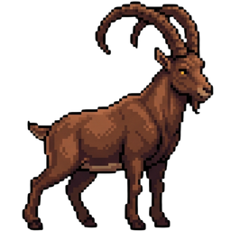

# OMU Crazy Climber

An endless 2D retro climber game built with HTML5 Canvas and Next.js. Pixel-art visuals, coin-based power jumps, procedural platforms, and a fullscreen mode.



## Features

- **Endless climbing** — Procedurally generated platforms scale in difficulty with altitude (standard, moving, crumbling, spring)
- **Coin economy** — Collect gold coins for +50 pts each; spend 5 for a Shift-powered mega jump
- **Parallax backgrounds** — Ground, sky, and upper-sky layers create depth as you climb
- **Pixel-art sprite system** — Character has idle, jump, and 6-frame walk animations; spinning coin animation
- **Retro sound synthesis** — Web Audio API chiptune background music and SFX (jump, coin, spring, crumble, game over)
- **Fullscreen mode** — Fills viewport height with maroon sides; Escape to exit; mobile requires fullscreen before playing
- **Mobile touch controls** — On-screen left, right, jump, and power-jump buttons when in fullscreen on mobile
- **Persistence** — High score saved to localStorage

## Controls

| Action | Keyboard | Mobile Touch |
|--------|----------|-------------|
| Move Left / Right | A / D or ◀ ▶ | ◀ ▶ buttons |
| Jump | W / ▲ / Space | ▲ button |
| Power Jump (costs 5 coins) | Shift + ▲ / W / Space | ▲▲ button |
| Start / Retry | Any key | Tap overlay button |
| Pause / Resume | Pause button (canvas) | Pause button |
| Mute / Unmute | Mute button (canvas) | Mute button |
| Toggle Fullscreen | Fullscreen button (canvas) / Escape to exit | Fullscreen button |

## Platforms & Collectibles

| Type | Description |
|------|-------------|
| **Standard** | Mossy grass-topped dirt blocks. Safe to jump on. |
| **Moving** | Sliding steel platforms that bounce off screen edges. |
| **Crumbling** | Cracked sandstone. Breaks shortly after you land (probability scales 15% → 40% with altitude). |
| **Spring** | Coiled launcher. Bounces you sky-high on contact. |
| **Gold Coin** | +50 pts. Appears above standard / moving platforms. Spend 5 for a Shift mega jump. |

## Getting Started

```bash
npm install
npm run dev
```

Open [http://localhost:3000](http://localhost:3000) in your browser.

### Build for production

```bash
npm run build
npm start
```

## Tech Stack

- **Framework:** Next.js 16 (React 19)
- **Rendering:** HTML5 Canvas 2D with `requestAnimationFrame`
- **Audio:** Web Audio API (oscillator-based chiptune synthesis)
- **Styling:** Tailwind CSS v4
- **Icons:** Lucide React
- **Canvas resolution:** 480 × 640 (logical), displayed at 3:4 aspect ratio

## Project Structure

```
.
├── app/
│   ├── layout.tsx          # Root layout, font loading, favicon
│   ├── page.tsx            # React UI shell (overlays, controls, fullscreen, mobile)
│   └── globals.css         # Tailwind theme and CSS variables
├── lib/
│   └── retro-climber.ts    # Core game engine (physics, rendering, input, audio)
├── public/
│   ├── idle.png            # Idle character sprite (favicon)
│   ├── jump.png            # Jump character sprite
│   ├── walk.png            # 6-frame walk spritesheet
│   ├── coin.png            # 6-frame coin spritesheet
│   ├── ground.png          # Ground background layer
│   ├── sky.png             # First sky background layer
│   ├── sky2.png            # Upper sky background layer (index ≥ 2)
│   └── ...
└── package.json
```

## Development

- The game engine lives entirely in `lib/retro-climber.ts` — a self-contained class managing physics, rendering, input, and audio.
- `app/page.tsx` wraps the engine in a React shell with state overlays (START, PAUSED, GAME_OVER), fullscreen toggle, mobile detection, and touch controls.
- `public/sky2.png` is used for all sky layers above the first (index ≥ 2).

## License

MIT
